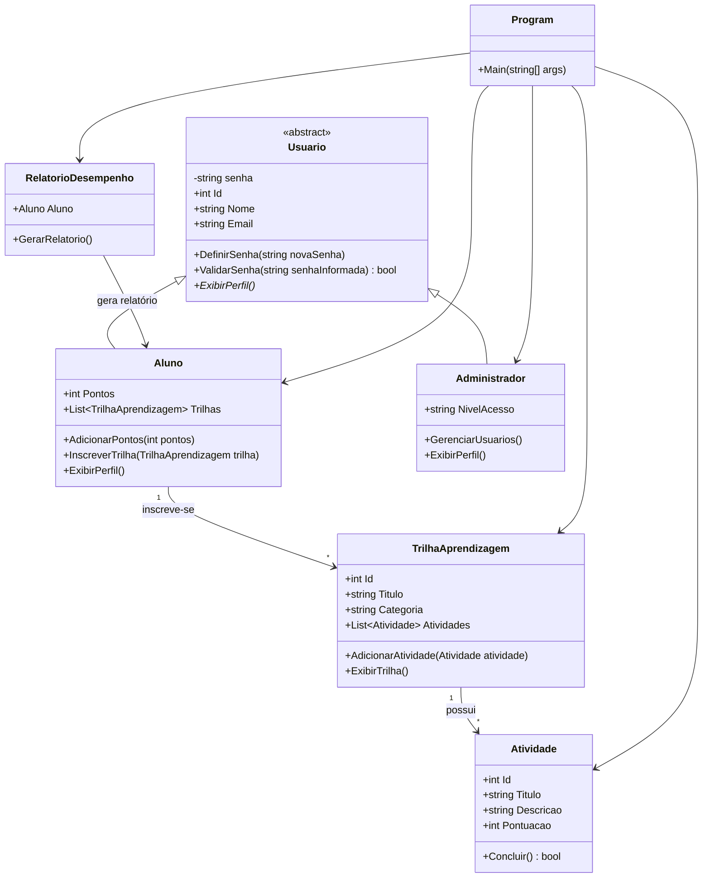

```mermaid
classDiagram

    class Usuario {
        <<abstract>>
        -string senha
        +int Id
        +string Nome
        +string Email
        +DefinirSenha(string novaSenha)
        +ValidarSenha(string senhaInformada) bool
        +ExibirPerfil()*
    }

    class Aluno {
        +int Pontos
        +List~TrilhaAprendizagem~ Trilhas
        +AdicionarPontos(int pontos)
        +InscreverTrilha(TrilhaAprendizagem trilha)
        +ExibirPerfil()
    }

    class Administrador {
        +string NivelAcesso
        +GerenciarUsuarios()
        +ExibirPerfil()
    }

    class TrilhaAprendizagem {
        +int Id
        +string Titulo
        +string Categoria
        +List~Atividade~ Atividades
        +AdicionarAtividade(Atividade atividade)
        +ExibirTrilha()
    }

    class Atividade {
        +int Id
        +string Titulo
        +string Descricao
        +int Pontuacao
        +Concluir() bool
    }

    class RelatorioDesempenho {
        +Aluno Aluno
        +GerarRelatorio()
    }

    class Program {
        +Main(string[] args)
    }

    Usuario <|-- Aluno
    Usuario <|-- Administrador

    Aluno "1" --> "*" TrilhaAprendizagem : inscreve-se
    TrilhaAprendizagem "1" --> "*" Atividade : possui
    RelatorioDesempenho --> Aluno : gera relatório
    Program --> Aluno
    Program --> Administrador
    Program --> TrilhaAprendizagem
    Program --> Atividade
    Program --> RelatorioDesempenho
```
